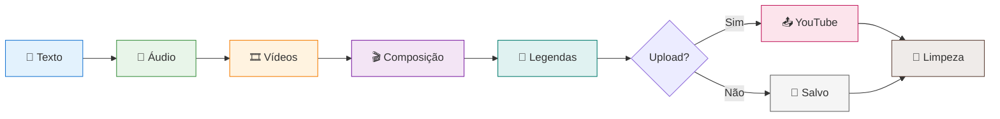

# 🎬 Gerador de Vídeos Bíblicos

Sistema automatizado para geração de vídeos de livros bíblicos com narração, vídeos de fundo, legendas e publicação no YouTube.

## 📋 Requisitos

- Python 3.8+
- APIs: Pexels (obrigatório), Azure Speech Services (opcional), YouTube Data API v3 (opcional)

## 🛠️ Instalação

```bash
# 1. Instalar dependências
pip install -r requirements.txt

# 2. Configurar variáveis de ambiente
cp config/env_example.txt .env

# 3. Editar .env com suas chaves
PEXELS_API_KEY=sua_chave_pexels
AZURE_SPEECH_KEY=sua_key_azure  # Opcional
AZURE_SPEECH_REGION=eastus      # Opcional

# 4. Configurar YouTube (opcional)
# Baixar client_secret.json do Google Cloud Console
# Colocar na pasta config/
```

## 🚀 Uso

```bash
# Execução interativa
python run.py

# Gerar vídeo específico
python run.py genesis

# Configurar opções
python run.py config

# Ver ajuda
python run.py help
```

## 📐 Arquitetura do Sistema

### Componentes Principais

```
YouTubeVideoGenerator/
├── run.py                                    # Entry point
├── video/
│   ├── video_generation_orchestrator.py     # Orquestrador principal
│   ├── bible_video_generator.py             # Gerador de vídeos
│   ├── pexels_video_fetcher.py              # Busca de vídeos
│   ├── video_creator.py                     # Composição de vídeo
│   └── youtube_publisher.py                 # Publicação no YouTube
├── audio/
│   └── audio_generator.py                   # Geração de áudio (TTS)
├── text/
│   ├── bible_text_generator.py              # Obtenção de texto bíblico
│   └── subtitle_generator.py                # Geração de legendas
├── config/
│   ├── config.py                            # Configurações globais
│   ├── config_ui.py                         # Interface de configuração
│   └── video_config.json                    # Configurações salvas
├── bible_data/                              # Dados bíblicos locais (JSON)
└── cleanup.py                               # Sistema de limpeza
```

### Responsabilidades dos Módulos

| Módulo | Responsabilidade |
|--------|-----------------|
| `VideoGenerationOrchestrator` | Controla fluxo de execução, menus e comandos |
| `BibleVideoGenerator` | Coordena etapas de geração do vídeo |
| `BibleTextGenerator` | Obtém texto bíblico (local ou API) |
| `AudioGenerator` | Converte texto em áudio (Azure TTS, gTTS, pyttsx3) |
| `PexelsVideoFetcher` | Busca e baixa vídeos do Pexels |
| `VideoCreator` | Combina áudio + vídeos + música de fundo |
| `SubtitleGenerator` | Gera arquivos SRT/VTT de legendas |
| `YouTubePublisher` | Upload de vídeos e legendas no YouTube |
| `Config` | Gerencia configurações personalizadas |

## 🔄 Fluxograma de Execução

```mermaid
graph TD
    Start([🚀 python run.py]) --> Orchestrator[📋 VideoGenerationOrchestrator]
    
    Orchestrator --> Choice{Escolha do Usuário}
    Choice -->|config| Config[⚙️ Abrir Configurações]
    Choice -->|help| Help[❓ Mostrar Ajuda]
    Choice -->|geração| Generate[🎬 Iniciar Geração]
    
    Config --> End1([✅ Fim])
    Help --> End2([✅ Fim])
    
    Generate --> VideoGen[🎥 BibleVideoGenerator.generate_full_video]
    
    VideoGen --> Step1[📖 ETAPA 1: Gerar Texto]
    Step1 --> Step1Details[BibleTextGenerator<br/>- Dados locais JSON<br/>- API fallback]
    Step1Details --> Step1Output[📄 output/temp/livro_text.txt]
    
    Step1Output --> Step2[🎤 ETAPA 2: Gerar Áudio]
    Step2 --> Step2Details[AudioGenerator<br/>- Azure TTS neurais<br/>- gTTS Google<br/>- pyttsx3 local]
    Step2Details --> Step2Output[🔊 output/audio/livro_audio.mp3]
    
    Step2Output --> Step3[🎞️ ETAPA 3: Buscar Vídeos]
    Step3 --> Step3Details[PexelsVideoFetcher<br/>- API Pexels<br/>- Download automático]
    Step3Details --> Step3Output[📹 output/pexels_videos/*.mp4]
    
    Step3Output --> Step4[🎬 ETAPA 4: Criar Vídeo]
    Step4 --> Step4Details[VideoCreator MoviePy<br/>- Concatenação vídeos<br/>- Sincronização áudio<br/>- Música de fundo<br/>- Transições]
    Step4Details --> Step4Output[🎥 output/videos/livro_final.mp4]
    
    Step4Output --> Step5[💬 ETAPA 5: Gerar Legendas]
    Step5 --> Step5Details[SubtitleGenerator<br/>- Divisão de texto<br/>- Cálculo de timing<br/>- Formato SRT/VTT]
    Step5Details --> Step5Output[📝 output/subtitles/livro.srt]
    
    Step5Output --> Step6Decision{Publicar no<br/>YouTube?}
    Step6Decision -->|Sim| Step6[📤 ETAPA 6: Upload YouTube]
    Step6Decision -->|Não| Step7
    
    Step6 --> Step6Details[YouTubePublisher<br/>- OAuth 2.0<br/>- Upload vídeo<br/>- Upload legendas<br/>- Metadados]
    Step6Details --> Step6Output[🌐 URL do vídeo]
    
    Step6Output --> Step7[🧹 ETAPA 7: Limpeza Automática]
    Step7 --> Step7Details[Cleanup System<br/>- Remove temporários<br/>- Remove cache<br/>- Mantém vídeo final]
    Step7Details --> Success([✅ Processo Concluído])
    
    VideoGen -.->|Erro| ErrorCleanup[❌ Limpeza por Erro]
    VideoGen -.->|Ctrl+C| InterruptCleanup[⛔ Limpeza por Interrupção]
    ErrorCleanup --> Failed([❌ Processo Falhou])
    InterruptCleanup --> Interrupted([⛔ Processo Interrompido])
    
    style Start fill:#4CAF50,stroke:#2E7D32,stroke-width:3px,color:#fff
    style Success fill:#4CAF50,stroke:#2E7D32,stroke-width:3px,color:#fff
    style Failed fill:#f44336,stroke:#c62828,stroke-width:3px,color:#fff
    style Interrupted fill:#FF9800,stroke:#E65100,stroke-width:3px,color:#fff
    style Step1 fill:#2196F3,stroke:#1565C0,stroke-width:2px,color:#fff
    style Step2 fill:#2196F3,stroke:#1565C0,stroke-width:2px,color:#fff
    style Step3 fill:#2196F3,stroke:#1565C0,stroke-width:2px,color:#fff
    style Step4 fill:#2196F3,stroke:#1565C0,stroke-width:2px,color:#fff
    style Step5 fill:#2196F3,stroke:#1565C0,stroke-width:2px,color:#fff
    style Step6 fill:#9C27B0,stroke:#6A1B9A,stroke-width:2px,color:#fff
    style Step7 fill:#607D8B,stroke:#37474F,stroke-width:2px,color:#fff
```



### 📊 Visão Simplificada do Pipeline



### Detalhamento das Etapas

#### **Etapa 1: Geração de Texto**
- Busca texto do livro bíblico em `bible_data/*.json`
- Fallback para API externa se necessário
- Salva em `output/temp/{livro}_text.txt`

#### **Etapa 2: Geração de Áudio**
- Tenta Azure Speech Services (vozes neurais)
- Fallback para gTTS (Google Text-to-Speech)
- Fallback final para pyttsx3 (TTS local)
- Salva em `output/audio/{livro}_audio.mp3`
- Calcula duração do áudio

#### **Etapa 3: Busca de Vídeos**
- Gera queries relacionadas ao livro bíblico
- Busca vídeos no Pexels via API
- Baixa vídeos suficientes para cobrir duração do áudio
- Salva em `output/pexels_videos/video_*.mp4`

#### **Etapa 4: Criação do Vídeo**
- Concatena vídeos do Pexels
- Sincroniza com áudio de narração
- Adiciona música de fundo (opcional)
- Aplica transições e efeitos
- Salva em `output/videos/{livro}_final.mp4`

#### **Etapa 5: Geração de Legendas**
- Divide texto em segmentos baseados em duração
- Calcula timing de cada segmento
- Gera arquivo SRT com timestamps
- Salva em `output/subtitles/{livro}_subtitles.srt`

#### **Etapa 6: Publicação no YouTube** *(Opcional)*
- Autentica via OAuth 2.0
- Faz upload do vídeo com metadados
- Faz upload das legendas
- Retorna URL do vídeo publicado

#### **Etapa 7: Limpeza Automática**
- Remove arquivos temporários:
  - Textos (`temp/*_text.txt`)
  - Áudios (`audio/*_audio.mp3`)
  - Vídeos Pexels (`pexels_videos/*.mp4`)
  - Legendas (`subtitles/*_subtitles.srt`)
  - Música de fundo (`temp/background_music.mp3`)
  - Temporários do MoviePy (`temp/temp-audio*`)
- Mantém apenas vídeo final em `output/videos/`

## 🧹 Sistema de Limpeza

### Limpeza Automática
Acionada automaticamente em:
- ✅ Após publicação bem-sucedida no YouTube
- ❌ Após erro durante geração
- ⛔ Após interrupção manual (Ctrl+C)

### Limpeza Manual
```bash
# Limpar tudo
python cleanup.py

# Limpar livro específico
python cleanup.py genesis
```

### Arquivos Preservados
- Vídeo final: `output/videos/{livro}_final.mp4`
- Dados bíblicos: `bible_data/*.json`
- Configurações: `config/video_config.json`

## ⚙️ Sistema de Configuração

### Arquivo: `config/video_config.json`

```json
{
  "subject": "livro-biblico",
  "duration": "auto",
  "language": "pt",
  "voice_speed": 1.0,
  "voice_gender": "female",
  "video_quality": "high",
  "background_music": true,
  "background_music_volume": 0.3,
  "subtitle_style": "modern",
  "video_style": "calm",
  "custom_queries": [],
  "youtube_settings": {
    "privacy": "private",
    "category": "22",
    "auto_publish": false
  }
}
```

### Opções Configuráveis

| Configuração | Valores | Descrição |
|-------------|---------|-----------|
| `language` | pt, en, es, fr, de, it | Idioma da narração |
| `voice_speed` | 0.5 - 3.0 | Velocidade da voz |
| `voice_gender` | male, female | Gênero da voz |
| `video_quality` | low, medium, high | Qualidade (720p, 1080p, 4K) |
| `video_style` | dynamic, calm, dramatic | Estilo das transições |
| `subtitle_style` | classic, modern, minimal | Estilo das legendas |
| `background_music` | true, false | Música de fundo |
| `background_music_volume` | 0.0 - 1.0 | Volume da música |
| `youtube_settings.privacy` | private, unlisted, public | Privacidade do vídeo |
| `youtube_settings.auto_publish` | true, false | Publicação automática |

## 📚 Dados Bíblicos Locais

### Download de Livros
```bash
python bible_data/download_bible_books.py
```

- **Fonte**: [bible-api.com](https://bible-api.com)
- **Versão**: King James Version (KJV)
- **Formato**: JSON estruturado
- **Total**: 66 livros bíblicos

### Estrutura JSON
```json
{
  "book": "Genesis",
  "chapters": [
    {
      "chapter": 1,
      "verses": [
        {"verse": 1, "text": "In the beginning..."},
        ...
      ]
    }
  ]
}
```

## 🔍 Troubleshooting Rápido

| Problema | Solução |
|----------|---------|
| Erro de API Pexels | Verificar `PEXELS_API_KEY` no `.env` |
| Áudio sem voz | Configurar `AZURE_SPEECH_KEY` (opcional) |
| Erro de autenticação YouTube | Verificar `client_secret.json` em `config/` |
| Vídeo não gerado | Verificar logs de erro, executar limpeza manual |

## 📦 Dependências Principais

- `moviepy` - Edição de vídeo
- `pexels-api` - Busca de vídeos
- `azure-cognitiveservices-speech` - Vozes neurais (opcional)
- `gtts` - Google Text-to-Speech
- `google-api-python-client` - YouTube API
- `pydub` - Processamento de áudio

---

**Desenvolvido para compartilhar a Palavra de Deus através de tecnologia**
