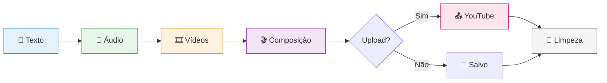

# 🎬 Gerador de Vídeos Bíblicos

Sistema automatizado para geração de vídeos de livros bíblicos com narração, vídeos de fundo e publicação no YouTube. Suporta múltiplos idiomas e é totalmente configurável.

## 📋 Requisitos

- Python 3.8+
- APIs: Pexels (obrigatório), Azure Speech Services (opcional), YouTube Data API v3 (opcional)

## 🛠️ Instalação

```bash
# 1. Instalar dependências
pip install -r requirements.txt

# 2. Configurar variáveis de ambiente
cp config/env_example.txt .env

# 3. Editar .env com suas chaves
PEXELS_API_KEY=sua_chave_pexels
AZURE_SPEECH_KEY=sua_key_azure  # Opcional
AZURE_SPEECH_REGION=eastus      # Opcional

# 4. Configurar YouTube (opcional)
# Baixar client_secret.json do Google Cloud Console
# Colocar na pasta config/
```

## 🚀 Uso

```bash
# Execução interativa
python run.py

# Gerar vídeo específico
python run.py genesis

# Configurar opções
python run.py config

# Ver ajuda
python run.py help

# Limpeza manual
python utils/cleanup.py
```

## 📐 Arquitetura do Sistema

### Componentes Principais

```
YouTubeVideoGenerator/
├── run.py                                    # Entry point
├── utils/
│   └── cleanup.py                           # Sistema de limpeza
├── video/
│   ├── video_generation_orchestrator.py     # Orquestrador principal
│   ├── bible_video_generator.py             # Gerador de vídeos
│   ├── pexels_video_fetcher.py              # Busca de vídeos
│   ├── video_creator.py                     # Composição de vídeo
│   └── youtube_publisher.py                 # Publicação no YouTube
├── audio/
│   └── audio_generator.py                   # Geração de áudio (TTS)
├── text/
│   └── bible_text_generator.py              # Obtenção de texto bíblico
├── config/
│   ├── config.py                            # Configurações globais
│   ├── config_ui.py                         # Interface de configuração
│   └── video_config.json                    # Configurações salvas
└── bible_data/
    ├── bible_data_creator.py                # Criador de dados bíblicos
    ├── download_bible_books.py              # Download de livros
    ├── calculate_book_durations.py          # Cálculo de durações
    └── *.json                               # Dados bíblicos locais
```

### Responsabilidades dos Módulos

| Módulo | Responsabilidade |
|--------|-----------------|
| `VideoGenerationOrchestrator` | Controla fluxo de execução, menus e comandos |
| `BibleVideoGenerator` | Coordena etapas de geração do vídeo |
| `BibleTextGenerator` | Obtém texto bíblico (local ou API) |
| `BibleDataCreator` | Cria e gerencia dados bíblicos em múltiplos idiomas |
| `AudioGenerator` | Converte texto em áudio (Azure TTS, gTTS, pyttsx3) |
| `PexelsVideoFetcher` | Busca e baixa vídeos do Pexels |
| `VideoCreator` | Combina áudio + vídeos + música de fundo |
| `YouTubePublisher` | Upload de vídeos no YouTube |
| `Config` | Gerencia configurações personalizadas |

## 🔄 Fluxograma de Execução


### 📊 Visão Simplificada do Pipeline



### Detalhamento das Etapas

#### **Etapa 1: Geração de Texto**
- Busca texto do livro bíblico em `bible_data/*.json`
- Fallback para API externa se necessário
- Salva em `output/temp/{livro}_text.txt`

#### **Etapa 2: Geração de Áudio**
- Tenta Azure Speech Services (vozes neurais)
- Fallback para gTTS (Google Text-to-Speech)
- Fallback final para pyttsx3 (TTS local)
- Salva em `output/audio/{livro}_audio.mp3`
- Calcula duração do áudio

#### **Etapa 3: Busca de Vídeos**
- Gera queries relacionadas ao livro bíblico
- Busca vídeos no Pexels via API
- Baixa vídeos suficientes para cobrir duração do áudio
- Salva em `output/pexels_videos/video_*.mp4`

#### **Etapa 4: Criação do Vídeo**
- Concatena vídeos do Pexels
- Sincroniza com áudio de narração
- Adiciona música de fundo (opcional)
- Aplica transições e efeitos
- Salva em `output/videos/{livro}_final.mp4`

#### **Etapa 5: Publicação no YouTube** *(Opcional)*
- Autentica via OAuth 2.0
- Faz upload do vídeo com metadados
- Retorna URL do vídeo publicado
- YouTube gera legendas automaticamente via reconhecimento de fala

#### **Etapa 6: Limpeza Automática**
- Remove arquivos temporários:
  - Textos (`temp/*_text.txt`)
  - Áudios (`audio/*_audio.mp3`)
  - Vídeos Pexels (`pexels_videos/*.mp4`)
  - Música de fundo (`temp/background_music.mp3`)
  - Temporários do MoviePy (`temp/temp-audio*`)
- Mantém apenas vídeo final em `output/videos/`

## 🌍 Sistema Multi-Idioma

O sistema é completamente agnóstico ao idioma, permitindo gerar vídeos bíblicos em qualquer língua suportada sem necessidade de criar arquivos específicos para cada idioma.

### Idiomas Suportados

| Código | Nome Completo          | Status |
|--------|------------------------|--------|
| `pt`   | Português (Brasil)     | ✓      |
| `pt-pt`| Português (Portugal)   | ✓      |
| `en`   | English (US)           | ✓      |
| `en-gb`| English (UK)           | ✓      |
| `es`   | Español                | ✓      |
| `fr`   | Français               | ✓      |
| `de`   | Deutsch                | ✓      |
| `it`   | Italiano               | ✓      |
| `ru`   | Русский                | ✓      |
| `zh`   | 中文                    | ✓      |
| `ja`   | 日本語                  | ✓      |
| `ko`   | 한국어                  | ✓      |
| `ar`   | العربية                | ✓      |
| `he`   | עברית                  | ✓      |

### Como Usar Diferentes Idiomas

#### Criar Dados Bíblicos em Qualquer Idioma

```python
from bible_data.bible_data_creator import BibleDataCreator

# Criar instância
creator = BibleDataCreator()

# Criar livro em português
chapter_texts_pt = {
    1: 'No princípio criou Deus os céus e a terra.',
    2: 'E assim foram acabados os céus e a terra.'
}
creator.create_bible_book('Gênesis', chapter_texts_pt, language='pt')

# Criar livro em inglês
chapter_texts_en = {
    1: 'In the beginning God created the heaven and the earth.',
    2: 'Thus the heavens and the earth were finished.'
}
creator.create_bible_book('Genesis', chapter_texts_en, language='en')

# Criar livro em espanhol
chapter_texts_es = {
    1: 'En el principio creó Dios los cielos y la tierra.',
    2: 'Fueron, pues, acabados los cielos y la tierra.'
}
creator.create_bible_book('Génesis', chapter_texts_es, language='es')
```

#### Gerar Texto Bíblico em Idioma Específico

```python
from text.bible_text_generator import BibleTextGenerator

# Criar gerador para português
generator_pt = BibleTextGenerator(language='pt')
texto = generator_pt.get_full_book_text('genesis')

# Criar gerador para inglês
generator_en = BibleTextGenerator(language='en')
text = generator_en.get_full_book_text('genesis')

# Alternar idioma dinamicamente
generator = BibleTextGenerator(language='en')
generator.set_language('pt')  # Muda para português
```

#### Gerar Vídeo em Idioma Específico

```python
from video.bible_video_generator import BibleVideoGenerator

# Criar gerador para inglês
generator_en = BibleVideoGenerator(language='en')
generator_en.generate_full_video('genesis', pexels_key, publish=False)

# Criar gerador para português
generator_pt = BibleVideoGenerator(language='pt')
generator_pt.generate_full_video('genesis', pexels_key, publish=False)
```

#### Configurar Idioma Padrão

Edite `video_config.json`:

```json
{
  "language": "pt",
  "voice_speed": 1.0,
  "voice_gender": "female",
  ...
}
```

Ou use a interface de configuração:

```bash
python run.py config
```

### Estrutura de Arquivos JSON

Os arquivos bíblicos incluem informação de idioma:

```json
{
  "reference": "Genesis",
  "language": "en",
  "language_name": "English (US)",
  "verses": [
    {
      "chapter": 1,
      "verse": 1,
      "text": "In the beginning God created..."
    }
  ],
  "text": "Full text...",
  "metadata": {
    "chapter_count": 50,
    "verse_count": 1533,
    "character_count": 150000,
    "word_count": 25000
  }
}
```

### Filtros por Idioma

#### Listar Livros Disponíveis em um Idioma

```python
from text.bible_text_generator import BibleTextGenerator

generator = BibleTextGenerator()

# Apenas livros em inglês
books_en = generator.get_available_books(language_filter='en')

# Apenas livros em português
books_pt = generator.get_available_books(language_filter='pt')
```

#### Listar Todos os Livros com Informação de Idioma

```python
from bible_data.bible_data_creator import BibleDataCreator

creator = BibleDataCreator()
books = creator.list_available_books()

for book in books:
    print(f"{book['book_name']} - {book['language_name']}")
```

### Adicionando Novo Idioma

Para adicionar suporte a um novo idioma:

1. **Adicionar à lista de idiomas suportados** em `bible_data/bible_data_creator.py`:

```python
SUPPORTED_LANGUAGES = {
    # ... idiomas existentes ...
    'ko': '한국어',  # Coreano
}
```

2. **Configurar API** em `text/bible_text_generator.py`:

```python
BIBLE_APIS = {
    # ... APIs existentes ...
    'ko': {
        'name': 'Bible API (Korean)',
        'base_url': 'https://bible-api.com',
        'version': 'kor'
    }
}
```

3. **Criar dados bíblicos** usando `bible_data/bible_data_creator.py`

4. **Configurar voz** para o novo idioma (se aplicável)

## 🧹 Sistema de Limpeza

### Limpeza Automática
Acionada automaticamente em:
- ✅ Após publicação bem-sucedida no YouTube
- ❌ Após erro durante geração
- ⛔ Após interrupção manual (Ctrl+C)

### Limpeza Manual
```bash
# Limpar tudo
python utils/cleanup.py

# Limpar livro específico
python utils/cleanup.py genesis
```

### Arquivos Preservados
- Vídeo final: `output/videos/{livro}_final.mp4`
- Dados bíblicos: `bible_data/*.json`
- Configurações: `config/video_config.json`

## ⚙️ Sistema de Configuração

### Arquivo: `config/video_config.json`

```json
{
  "subject": "livro-biblico",
  "duration": "auto",
  "language": "pt",
  "voice_speed": 1.0,
  "voice_gender": "female",
  "video_quality": "high",
  "background_music": true,
  "background_music_volume": 0.3,
  "video_style": "calm",
  "custom_queries": [],
  "youtube_settings": {
    "privacy": "private",
    "category": "22",
    "auto_publish": false
  }
}
```

### Opções Configuráveis

| Configuração | Valores | Descrição |
|-------------|---------|-----------|
| `language` | pt, en, es, fr, de, it, etc | Idioma da narração |
| `voice_speed` | 0.5 - 3.0 | Velocidade da voz |
| `voice_gender` | male, female | Gênero da voz |
| `video_quality` | low, medium, high | Qualidade (720p, 1080p, 4K) |
| `video_style` | dynamic, calm, dramatic | Estilo das transições |
| `background_music` | true, false | Música de fundo |
| `background_music_volume` | 0.0 - 1.0 | Volume da música |
| `youtube_settings.privacy` | private, unlisted, public | Privacidade do vídeo |
| `youtube_settings.auto_publish` | true, false | Publicação automática |

## 📚 Dados Bíblicos Locais

### Download de Livros
```bash
python bible_data/download_bible_books.py
```

- **Fonte**: [bible-api.com](https://bible-api.com)
- **Versão**: King James Version (KJV) e outras
- **Formato**: JSON estruturado com metadados de idioma
- **Total**: 66 livros bíblicos

### Cálculo de Durações
```bash
# Calcular durações por livro
python bible_data/calculate_book_durations.py

# Calcular durações por capítulo
python bible_data/calculate_chapter_durations.py
```

## 🔍 Troubleshooting Rápido

| Problema | Solução |
|----------|---------|
| Erro de API Pexels | Verificar `PEXELS_API_KEY` no `.env` |
| Áudio sem voz | Configurar `AZURE_SPEECH_KEY` (opcional) |
| Erro de autenticação YouTube | Verificar `client_secret.json` em `config/` |
| Vídeo não gerado | Verificar logs de erro, executar limpeza manual |
| Idioma não suportado | Adicionar idioma em `bible_data_creator.py` |

## 📦 Dependências Principais

- `moviepy` - Edição de vídeo
- `pexels-api` - Busca de vídeos
- `azure-cognitiveservices-speech` - Vozes neurais (opcional)
- `gtts` - Google Text-to-Speech
- `google-api-python-client` - YouTube API
- `pydub` - Processamento de áudio
- `python-dotenv` - Gerenciamento de variáveis de ambiente

## 🚀 Vantagens do Sistema

1. **Escalável** - Adicionar novo idioma é apenas configurar a API/dados
2. **Manutenível** - Um único código base para todos os idiomas
3. **Flexível** - Alterar idioma em tempo de execução
4. **Organizado** - Filtros automáticos por idioma
5. **Robusto** - Validação e metadados completos
6. **Documentado** - Cada componente tem documentação clara
7. **Automatizado** - Pipeline completo de geração e publicação

## 📝 Changelog

### v2.0 - Sistema Multi-Idioma
- ✓ Criado `bible_data_creator.py` genérico
- ✓ Atualizado `bible_text_generator.py` com suporte multi-idioma
- ✓ Integrado sistema de idiomas com `config.py`
- ✓ Atualizado `bible_video_generator.py` para aceitar idioma
- ✓ Suporte a 14+ idiomas
- ✓ Reorganizada estrutura de pastas
- ✓ Adicionados cálculos de duração por capítulo
- ✓ Movidos arquivos utilitários para pastas apropriadas

### v1.0 - Sistema Original
- Suporte para geração automatizada de vídeos
- Integração com Pexels, Azure TTS e YouTube
- Sistema de configuração personalizada

---

**Desenvolvido para compartilhar a Palavra de Deus através de tecnologia** 🙏
