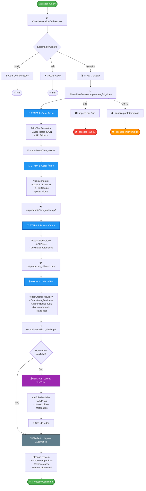
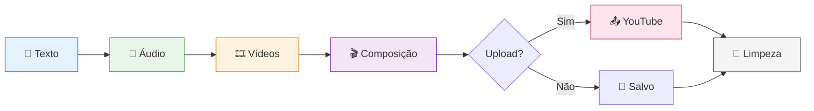

# 🎬 Gerador de Vídeos Bíblicos

Sistema automatizado para geração de vídeos de livros bíblicos com narração, vídeos de fundo e publicação no YouTube. Suporta múltiplos idiomas e é totalmente configurável.

---

## 📑 Sumário

- [Introdução](#-introdução)
- [Requisitos](#-requisitos)
- [Instalação](#-instalação)
- [Uso](#-uso)
- [Arquitetura do Sistema](#-arquitetura-do-sistema)
  - [Componentes Principais](#componentes-principais)
  - [Responsabilidades dos Módulos](#responsabilidades-dos-módulos)
  - [Fluxograma de Execução](#-fluxograma-de-execução)
  - [Detalhamento das Etapas](#detalhamento-das-etapas)
- [Sistema Multi-Idioma](#-sistema-multi-idioma)
  - [Idiomas Suportados](#idiomas-suportados)
  - [Como Usar Diferentes Idiomas](#como-usar-diferentes-idiomas)
  - [Estrutura de Arquivos JSON](#estrutura-de-arquivos-json)
  - [Adicionando Novo Idioma](#adicionando-novo-idioma)
- [Sistema de Configuração](#-sistema-de-configuração)
  - [Arquivo video_config.json](#arquivo-video_configjson)
  - [Opções Configuráveis](#opções-configuráveis)
- [Dados Bíblicos Locais](#-dados-bíblicos-locais)
  - [Download de Livros](#download-de-livros)
  - [Cálculo de Durações](#cálculo-de-durações)
- [Gerenciamento de Token do YouTube](#-gerenciamento-de-token-do-youtube)
  - [Como Funciona o Sistema de Tokens](#como-funciona-o-sistema-de-tokens)
  - [Gerar/Renovar Token](#gerarrenovar-token)
  - [Verificar Status do Token](#verificar-status-do-token)
  - [Quando Regenerar o Token](#quando-regenerar-o-token)
  - [Sistema de Renovação Automática](#sistema-de-renovação-automática)
  - [Solução de Problemas com Token](#solução-de-problemas-com-token)
  - [Segurança](#-segurança)
- [Automação com GitHub Actions](#-automação-com-github-actions)
  - [Como Funciona](#como-funciona-100-automático)
  - [Passo a Passo Completo](#-passo-a-passo-completo)
  - [Ajustar Horário de Execução](#-ajustar-horário-de-execução)
  - [Seleção de Livro](#-seleção-de-livro-aleatório)
  - [Monitoramento](#-monitoramento)
  - [Publicação Automática no YouTube](#-publicação-automática-no-youtube)
  - [Configurações do Vídeo](#-configurações-do-vídeo)
  - [Custos e Limites](#-custos-e-limites)
  - [Troubleshooting GitHub Actions](#-troubleshooting-github-actions)
  - [Checklist Final](#-checklist-final)
  - [Lista de 66 Livros](#-lista-de-66-livros)
- [Música de Fundo](#-música-de-fundo)
- [Sistema de Limpeza](#-sistema-de-limpeza)
- [Troubleshooting Rápido](#-troubleshooting-rápido)
- [Dependências Principais](#-dependências-principais)
- [Vantagens do Sistema](#-vantagens-do-sistema)
- [Changelog](#-changelog)

---

## 🎯 Introdução

Sistema automatizado para geração de vídeos de livros bíblicos com narração, vídeos de fundo e publicação no YouTube. Sistema em inglês, totalmente configurável e com notificações automáticas.

### Características Principais

- ✅ **Automatizado** - Pipeline completo de geração e publicação
- ✅ **Inglês** - Narração e texto em inglês de alta qualidade
- ✅ **Flexível** - Totalmente configurável
- ✅ **Escalável** - Funciona com GitHub Actions
- ✅ **Robusto** - Sistema de limpeza e recuperação de erros
- ✅ **Notificações** - Avisos automáticos por email sobre token expirando

---

## 📋 Requisitos

- Python 3.8+
- APIs: Pexels (obrigatório), Azure Speech Services (opcional), YouTube Data API v3 (opcional)

---

## 🛠️ Instalação

```bash
# 1. Instalar dependências
pip install -r requirements.txt

# 2. Configurar variáveis de ambiente
cp config/env_example.txt .env

# 3. Editar .env com suas chaves
PEXELS_API_KEY=sua_chave_pexels
AZURE_SPEECH_KEY=sua_key_azure  # Opcional
AZURE_SPEECH_REGION=eastus      # Opcional

# 4. Configurar YouTube (opcional)
# Baixar client_secret.json do Google Cloud Console
# Colocar na pasta config/
```

---

## 🚀 Uso

```bash
# Execução interativa
python run.py

# Gerar vídeo específico
python run.py genesis

# Configurar opções
python run.py config

# Ver ajuda
python run.py help

# Limpeza manual
python utils/cleanup.py
```

---

## 📐 Arquitetura do Sistema

### Componentes Principais

```
YouTubeVideoGenerator/
├── run.py                                    # Entry point
├── utils/
│   └── cleanup.py                           # Sistema de limpeza
├── video/
│   ├── video_generation_orchestrator.py     # Orquestrador principal
│   ├── bible_video_generator.py             # Gerador de vídeos
│   ├── pexels_video_fetcher.py              # Busca de vídeos
│   ├── video_creator.py                     # Composição de vídeo
│   └── youtube_publisher.py                 # Publicação no YouTube
├── audio/
│   └── audio_generator.py                   # Geração de áudio (TTS)
├── text/
│   └── bible_text_generator.py              # Obtenção de texto bíblico
├── config/
│   ├── config.py                            # Configurações globais
│   ├── config_ui.py                         # Interface de configuração
│   └── video_config.json                    # Configurações salvas
└── bible_data/
    ├── bible_data_creator.py                # Criador de dados bíblicos
    ├── download_bible_books.py              # Download de livros
    ├── calculate_book_durations.py          # Cálculo de durações
    └── *.json                               # Dados bíblicos locais
```

### Responsabilidades dos Módulos

| Módulo | Responsabilidade |
|--------|-----------------|
| `VideoGenerationOrchestrator` | Controla fluxo de execução, menus e comandos |
| `BibleVideoGenerator` | Coordena etapas de geração do vídeo |
| `BibleTextGenerator` | Obtém texto bíblico (local ou API) |
| `BibleDataCreator` | Cria e gerencia dados bíblicos em múltiplos idiomas |
| `AudioGenerator` | Converte texto em áudio (Azure TTS, gTTS, pyttsx3) |
| `PexelsVideoFetcher` | Busca e baixa vídeos do Pexels |
| `VideoCreator` | Combina áudio + vídeos + música de fundo |
| `YouTubePublisher` | Upload de vídeos no YouTube |
| `Config` | Gerencia configurações personalizadas |

### 🔄 Fluxograma de Execução



#### 📊 Visão Simplificada do Pipeline



### Detalhamento das Etapas

#### **Etapa 1: Geração de Texto**
- Busca texto do livro bíblico em `bible_data/*.json`
- Fallback para API externa se necessário
- Salva em `output/temp/{livro}_text.txt`

#### **Etapa 2: Geração de Áudio**
- Tenta Azure Speech Services (vozes neurais)
- Fallback para gTTS (Google Text-to-Speech)
- Fallback final para pyttsx3 (TTS local)
- Salva em `output/audio/{livro}_audio.mp3`
- Calcula duração do áudio

#### **Etapa 3: Busca de Vídeos**
- Gera queries relacionadas ao livro bíblico
- Busca vídeos no Pexels via API
- Baixa vídeos suficientes para cobrir duração do áudio
- Salva em `output/pexels_videos/video_*.mp4`

#### **Etapa 4: Criação do Vídeo**
- Concatena vídeos do Pexels
- Sincroniza com áudio de narração
- Adiciona música de fundo (opcional)
- Aplica transições e efeitos
- Salva em `output/videos/{livro}_final.mp4`

#### **Etapa 5: Publicação no YouTube** *(Opcional)*
- Autentica via OAuth 2.0
- Faz upload do vídeo com metadados
- Retorna URL do vídeo publicado
- YouTube gera legendas automaticamente via reconhecimento de fala

#### **Etapa 6: Limpeza Automática**
- Remove arquivos temporários:
  - Textos (`temp/*_text.txt`)
  - Áudios (`audio/*_audio.mp3`)
  - Vídeos Pexels (`pexels_videos/*.mp4`)
  - Música de fundo (`temp/background_music.mp3`)
  - Temporários do MoviePy (`temp/temp-audio*`)
- Mantém apenas vídeo final em `output/videos/`

---

## 🌍 Language

The system generates Bible videos in **English only**, using high-quality neural voices from Microsoft Edge TTS and Azure Speech Services.

### Voice Options

The system supports two voice genders in English:

| Gender | Voice Name | Provider |
|--------|------------|----------|
| Female | `en-US-AriaNeural` | Edge TTS / Azure |
| Male | `en-US-BrianMultilingualNeural` | Edge TTS / Azure |

**Configure in `video_config.json`:**

```json
{
  "voice_gender": "female",  // or "male"
  "voice_speed": 0.7,         // 0.5 to 3.0
  ...
}
```

### Bible Text Source

- **Language**: English (KJV - King James Version)
- **Source**: Local JSON files in `bible_data/` or fallback to bible-api.com
- **Format**: 66 books of the Bible in chronological order

### Why English Only?

The system was simplified to focus on quality over quantity:
- **Consistency**: Single language avoids text/audio mismatches
- **Simplicity**: Easier to maintain and debug
- **Quality**: High-quality neural voices available
- **Performance**: Optimized for one language

### Future Multi-Language Support

While the system currently supports only English, the architecture is designed to allow multi-language support in the future if needed

---

## ⚙️ Sistema de Configuração

### Arquivo: `config/video_config.json`

```json
{
  "subject": "livro-biblico",
  "duration": "auto",
  "voice_speed": 1.0,
  "voice_gender": "female",
  "video_quality": "high",
  "background_music": true,
  "background_music_volume": 0.3,
  "video_style": "calm",
  "custom_queries": [],
  "youtube_settings": {
    "privacy": "private",
    "category": "22",
    "auto_publish": false
  }
}
```

### Opções Configuráveis

| Configuração | Valores | Descrição |
|-------------|---------|-----------|
| `voice_speed` | 0.5 - 3.0 | Velocidade da voz |
| `voice_gender` | male, female | Gênero da voz (inglês) |
| `video_quality` | low, medium, high | Qualidade (720p, 1080p, 4K) |
| `video_style` | dynamic, calm, dramatic | Estilo das transições |
| `background_music` | true, false | Música de fundo |
| `background_music_volume` | 0.0 - 1.0 | Volume da música |
| `youtube_settings.privacy` | private, unlisted, public | Privacidade do vídeo |
| `youtube_settings.auto_publish` | true, false | Publicação automática |

#### Available English Voices

- **Female:** `en-US-AriaNeural` (Edge TTS and Azure)
- **Male:** `en-US-BrianMultilingualNeural` (Edge TTS and Azure)

---

## 📚 Dados Bíblicos Locais

### Download de Livros (English)

```bash
# Download all 66 Bible books
python bible_data/download_bible_books.py
```

**Features:**
- **Source**: [bible-api.com](https://bible-api.com)
- **Version**: KJV (King James Version)
- **Format**: Structured JSON with metadata
- **Total**: 66 Bible books

**Data structure:**
- Local JSON files in `bible_data/`
- Fallback to online API if local files missing
- Automatic caching for faster access

### Cálculo de Durações

```bash
# Calcular durações por livro
python bible_data/calculate_book_durations.py

# Calcular durações por capítulo
python bible_data/calculate_chapter_durations.py
```

---

## 🔐 Gerenciamento de Token do YouTube

### Como Funciona o Sistema de Tokens

O YouTube usa OAuth 2.0 com dois tipos de tokens:

1. **Access Token**: Válido por 1 hora, usado para fazer requisições à API
2. **Refresh Token**: Válido por ~6 meses de inatividade, usado para obter novos Access Tokens

⚠️ **IMPORTANTE**: Quando o Refresh Token expira ou é revogado, você **DEVE** gerar um novo token manualmente. Não é possível renovar automaticamente sem interação do usuário (limitação de segurança do OAuth2).

### Gerar/Renovar Token

```bash
# 1. Execute o script localmente
python config/generate_youtube_token.py

# 2. Autentique no navegador
# 3. Copie o token gerado
# 4. Atualize no GitHub Secret YOUTUBE_TOKEN
```

**Método alternativo para copiar token:**

```bash
# Copia token automaticamente para a área de transferência
python config/copy_token_to_clipboard.py
```

### Verificar Status do Token

```bash
# Verificar se o token está válido
python config/check_token_status.py
```

### Quando Regenerar o Token

Você precisa regenerar quando:
- ✗ Token expirou (após ~6 meses de inatividade)
- ✗ Vê o erro: `invalid_grant: Token has been expired or revoked`
- ✗ Acesso foi revogado manualmente no Google
- ✗ Credenciais do `client_secret.json` foram alteradas

### Sistema de Renovação Automática

O sistema automaticamente:
- ✓ Renova o Access Token quando ele expira (1 hora)
- ✓ Detecta quando o Refresh Token está inválido
- ✓ Remove tokens inválidos automaticamente
- ✓ Exibe instruções claras de como resolver

### Solução de Problemas com Token

#### Erro: "Token has been expired or revoked"

**Causa**: O Refresh Token expirou ou foi revogado.

**Solução**: 

1. **Regenere o token localmente:**
   ```bash
   python config/generate_youtube_token.py
   ```

2. **Copie o novo token:**
   ```bash
   # Opção 1: Copiar automaticamente
   python config/copy_token_to_clipboard.py
   
   # Opção 2: Copiar manualmente
   # Abra config/token.json e copie todo o conteúdo
   ```

3. **Atualize no GitHub:**
   - Vá em: Settings → Secrets and variables → Actions
   - Encontre: `YOUTUBE_TOKEN`
   - Clique em **Update**
   - Cole o novo token
   - Salve!

#### Erro: "client_secret.json não encontrado"

**Causa**: O arquivo de credenciais do Google Cloud não existe.

**Solução**: 
1. Vá para [Google Cloud Console](https://console.cloud.google.com/)
2. Crie um novo projeto ou selecione o existente
3. Ative a YouTube Data API v3
4. Crie credenciais OAuth 2.0
5. Baixe o arquivo e salve como `config/client_secret.json`

#### Erro: "The file token.json has been tampered with"

**Causa**: O arquivo token.json está corrompido.

**Solução**: Delete `config/token.json` e regenere o token.

### 🔐 Segurança

#### ⚠️ NUNCA faça:

- ❌ Commitar `token.json` no repositório
- ❌ Compartilhar o token publicamente
- ❌ Expor o token em logs ou mensagens de erro

#### ✅ SEMPRE faça:

- ✅ Mantenha `token.json` em `.gitignore`
- ✅ Use GitHub Secrets para CI/CD
- ✅ Regenere o token se houver suspeita de comprometimento

### Formato do Token

#### ✅ Formato Correto (JSON):
```json
{
  "token": "ya29.a0AfH6SMB...",
  "refresh_token": "1//0gF3X...",
  "token_uri": "https://oauth2.googleapis.com/token",
  "client_id": "123456789...",
  "client_secret": "GOCSPX-...",
  "scopes": ["https://www.googleapis.com/auth/youtube.upload"]
}
```

#### ❌ Formato Incorreto (Pickle/String):
```
ASVBAQAAAAAAACMGWdvb2dsZS5vYXV0aDIuY3JlZGVudGlhbHOUjAtDcmVkZW50aWFsc5STlCmBlH2U...
```

O código agora suporta **tokens em formato JSON** (compatível com GitHub Secrets) ao invés de apenas pickle binário. Isso garante compatibilidade tanto local quanto no GitHub Actions.

---

## 📧 Sistema de Notificações por Email

### Visão Geral

O sistema inclui notificações automáticas por email para avisar quando é hora de renovar o token do YouTube, evitando interrupções na publicação de vídeos.

### Como Funciona

- **Frequência**: Email enviado automaticamente a cada **6 dias**
- **Rastreamento**: Sistema rastreia última data de envio em `notifications/last_email_sent.json`
- **Integração**: Executado automaticamente ANTES da geração de vídeo na pipeline
- **Falha segura**: Se email falhar, pipeline continua normalmente

### Configuração do Gmail App Password

⚠️ **IMPORTANTE**: Você precisa de um **App Password**, NÃO sua senha regular do Gmail!

**Passo a passo:**

1. Acesse: https://myaccount.google.com/apppasswords
2. Faça login na sua conta Google
3. Em "Select app", escolha "Mail"
4. Em "Select device", escolha "Other" e digite "YouTubeVideoGenerator"
5. Clique em "Generate"
6. Copie a senha de 16 caracteres gerada (ex: `abcd efgh ijkl mnop`)
7. Use essa senha no secret `EMAIL_PASSWORD`

### Secrets Necessários no GitHub

Adicione estes 3 secrets em: **Settings → Secrets and variables → Actions**

| Secret | Valor | Exemplo |
|--------|-------|---------|
| `EMAIL_SENDER` | Seu email Gmail | `aronhrissato@gmail.com` |
| `EMAIL_RECIPIENT` | Email destinatário | `aronhrissato@gmail.com` |
| `EMAIL_PASSWORD` | App Password do Gmail | `abcd efgh ijkl mnop` |

### Teste Local

```bash
# Configure as variáveis de ambiente
export EMAIL_SENDER="seu-email@gmail.com"
export EMAIL_RECIPIENT="seu-email@gmail.com"
export EMAIL_PASSWORD="sua-app-password-aqui"

# Execute o notificador
python notifications/email_notifier.py
```

### Conteúdo do Email

O email enviado contém:

- **Assunto**: "Atualizar token YouTubeVideoGenerator"
- **Corpo**: Instruções completas de como regenerar o token
- **Idioma**: Português (conforme solicitado)
- **Frequência**: A cada 6 dias

### Estrutura do Tracking

Arquivo `notifications/last_email_sent.json`:

```json
{
  "last_sent_date": "2025-10-20T14:30:00.123456",
  "last_sent_readable": "2025-10-20 14:30:00"
}
```

### Fluxo na Pipeline

```
1. Checkout code
2. Setup Python
3. Install dependencies
4. Create directories
5. Setup YouTube credentials
6. ✉️ CHECK EMAIL NOTIFICATION (novo!)
   - Verifica se passaram 6 dias
   - Envia email se necessário
   - Atualiza tracking file
   - Continua pipeline independente do resultado
7. Generate video
8. Upload artifacts
9. Cleanup
```

### Troubleshooting

**Erro: "Gmail authentication failed"**
- Certifique-se de usar App Password, não senha regular
- Verifique se 2FA está ativado na conta Gmail
- Recrie o App Password se necessário

**Erro: "EMAIL_SENDER not set"**
- Adicione os secrets no GitHub Actions
- Verifique os nomes exatos dos secrets

**Email não chegou**
- Verifique spam/lixo eletrônico
- Confirme o email destinatário está correto
- Veja logs do GitHub Actions para erros

---

## 🚀 Automação com GitHub Actions

Guia completo para automatizar a geração de vídeos bíblicos usando GitHub Actions (100% gratuito e automático).

### Como Funciona (100% Automático)

```
1. GitHub Actions executa TODO DIA às 10:00 UTC (07:00 Brasília)
2. Script escolhe livro bíblico ALEATÓRIO (1-66)
3. Gera vídeo completo (até 8 horas de timeout)
4. Publica AUTOMATICAMENTE no YouTube
5. Limpa arquivos temporários
6. Fim! Zero interação necessária
```

**🇧🇷 Workflows Disponíveis:**
- **`generate-video.yml`** - Gera vídeos em inglês (10h UTC / 07h BRT)
- **`generate-video-pt.yml`** - Gera vídeos em português (21h UTC / 18h BRT)

Ambos funcionam de forma independente e podem executar no mesmo repositório.

### 🚀 Passo a Passo Completo

#### **Passo 1: Adicionar Secrets no GitHub**

1. Vá no seu repositório no GitHub
2. Clique em **Settings** (configurações)
3. No menu lateral, clique em **Secrets and variables** → **Actions**
4. Clique em **New repository secret**

##### Adicione estes secrets:

**Obrigatório:**
- Nome: `PEXELS_API_KEY`
- Valor: sua chave do Pexels (https://www.pexels.com/api/)

**Opcional (para melhor qualidade de voz):**
- Nome: `AZURE_SPEECH_KEY`
- Valor: sua chave do Azure Speech Services
- Nome: `AZURE_SPEECH_REGION`
- Valor: `eastus` (ou sua região)

**Opcional (para publicação automática no YouTube):**
- Nome: `YOUTUBE_CLIENT_SECRET`
- Valor: conteúdo do arquivo `config/client_secret.json`
- Nome: `YOUTUBE_TOKEN`
- Valor: conteúdo do arquivo `config/token.json`

##### 📌 Como Obter o YOUTUBE_TOKEN

1. **Execute localmente:**
   ```bash
   python config/generate_youtube_token.py
   ```

2. **Autentique no navegador** (abrirá automaticamente)

3. **Copie o token gerado** de uma destas formas:
   - O script exibirá o token no terminal
   - Ou execute: `python config/copy_token_to_clipboard.py` (copia automaticamente)
   - Ou abra manualmente: `config/token.json`

4. **Cole no GitHub Secret YOUTUBE_TOKEN**

⚠️ **IMPORTANTE SOBRE TOKENS:**
- Tokens expiram após ~6 meses de inatividade
- Quando expirar, você verá erro: `invalid_grant: Token has been expired or revoked`
- **Solução**: Regenere o token executando novamente `generate_youtube_token.py`
- Não é possível renovar automaticamente sem interação (limitação OAuth2)

#### **Passo 2: Fazer Commit e Push**

O workflow já está configurado para executar automaticamente. Apenas faça:

```bash
git add .
git commit -m "Adicionar automação de vídeos"
git push
```

**Pronto!** O sistema já está funcionando e executará automaticamente todo dia às 10:00 UTC (07:00 Brasília).

#### **Passo 3: Monitorar Primeira Execução**

Aguarde a primeira execução automática ou verifique execuções passadas:

1. No GitHub, vá em **Actions** (aba superior)
2. Veja o workflow **Generate Bible Video**
3. Clique em qualquer execução para ver logs em tempo real
4. O vídeo será publicado automaticamente no YouTube

### ⏰ Ajustar Horário de Execução

O workflow está configurado para executar **todo dia às 10:00 UTC (07:00 Brasília)**.

Para alterar o horário, edite a linha `cron` no arquivo `.github/workflows/generate-video.yml`:

#### Exemplos (sempre em UTC):

```yaml
# Todo dia às 10:00 UTC (07:00 Brasília)
- cron: '0 10 * * *'

# Todo dia às 12:00 UTC (09:00 Brasília)
- cron: '0 12 * * *'

# Todo dia às 15:00 UTC (12:00 Brasília)
- cron: '0 15 * * *'

# Todo dia às 18:00 UTC (15:00 Brasília)
- cron: '0 18 * * *'

# Segunda a sexta às 14:00 UTC (11:00 Brasília)
- cron: '0 14 * * 1-5'

# Duas vezes por dia: 10h e 22h UTC (07h e 19h Brasília)
- cron: '0 10,22 * * *'
```

**⚠️ IMPORTANTE:** 
- Horários são sempre em **UTC** (horário de Greenwich)
- **Brasil = UTC - 3 horas**
- Exemplo: 10:00 UTC = 07:00 Brasília
- Calculadora: https://crontab.guru/

### 🎯 Seleção de Livro (Aleatório)

O sistema está configurado para escolher **aleatoriamente** um dos 66 livros da Bíblia a cada execução.

Isso garante variedade e completa toda a Bíblia em aproximadamente 66 dias (considerando alguns livros repetidos pelo sorteio aleatório).

**Funciona assim:**
- A cada execução, o script sorteia um número de 1 a 66
- Esse número corresponde a um livro bíblico
- O vídeo é gerado para aquele livro
- Próxima execução = novo sorteio

Se quiser testar localmente com livro específico:
```bash
python run_automated.py 1        # Genesis
python run_automated.py 19       # Salmos
python run_automated.py genesis  # Por nome
```

### 📊 Monitoramento

#### Ver Execuções:
1. GitHub → **Actions**
2. Veja histórico de execuções
3. Clique em qualquer execução para ver logs

#### Ver Vídeo Gerado:
1. Na execução bem-sucedida, vá em **Artifacts**
2. Baixe `generated-video-XXX`
3. O vídeo estará no arquivo .zip

#### Verificar Erros:
- Se falhar, veja os logs no próprio GitHub Actions
- Artifacts também incluem logs de erro

### 📹 Publicação Automática no YouTube

#### Configurar:

##### **Método 1: OAuth Token (Recomendado)**

1. Execute localmente uma vez:
```bash
python run.py
```

2. Faça login no YouTube quando solicitado

3. Dois arquivos serão criados na pasta `config/`:
   - `client_secret.json`
   - `token.json`

4. Adicione como secrets no GitHub:

**YOUTUBE_CLIENT_SECRET:**
```bash
# Copie todo conteúdo do arquivo
cat config/client_secret.json
```

**YOUTUBE_TOKEN:**
```bash
# Copie todo conteúdo do arquivo
cat config/token.json
```

5. No `video_config.json`, configure:
```json
{
  "youtube_settings": {
    "privacy": "public",
    "category": "22",
    "auto_publish": true
  }
}
```

6. Commit e push do `video_config.json`:
```bash
git add video_config.json
git commit -m "Ativar auto-publicação YouTube"
git push
```

### 🎛️ Configurações do Vídeo

Edite o arquivo `video_config.json`:

```json
{
  "subject": "livro-biblico",
  "duration": "auto",
  "language": "en",
  "voice_speed": 0.8,
  "voice_gender": "male",
  "voice_volume": 1.0,
  "video_quality": "medium",
  "background_music": true,
  "background_music_volume": 0.2,
  "video_style": "calm",
  "custom_queries": [],
  "youtube_settings": {
    "privacy": "public",
    "category": "22",
    "auto_publish": true
  }
}
```

**Opções principais:**

- `language`: `"en"`, `"pt"`, `"es"`, `"fr"`, etc.
- `voice_speed`: `0.5` a `3.0` (1.0 = normal)
- `voice_gender`: `"male"` ou `"female"`
- `video_quality`: `"low"` (720p), `"medium"` (1080p), `"high"` (4K)
- `privacy`: `"public"`, `"unlisted"`, `"private"`
- `auto_publish`: `true` ou `false`

### 💰 Custos e Limites

**GitHub Actions:**
- Repositório público: **Ilimitado e grátis** ✨
- Repositório privado: **2000 minutos/mês grátis**

**Estimativa de uso (seu caso):**
- 1 vídeo/dia com até 8 horas de processamento
- Vídeos longos (3+ horas de áudio) = 4-6 horas de processamento
- Vídeos curtos = 1-2 horas de processamento
- **Média estimada:** ~4 horas por vídeo = 120 horas/mês

**Recomendação:**
- Use **repositório público** = ilimitado e grátis
- Ou repositório privado se tiver GitHub Pro (3000 min/mês)

**Timeout configurado:** 8 horas (480 minutos) por execução

### 🐛 Troubleshooting GitHub Actions

#### Erro: "PEXELS_API_KEY not found"
- Verifique se adicionou o secret no GitHub
- Nome deve ser exatamente `PEXELS_API_KEY`

#### Erro: Timeout
- Edite o workflow e aumente `timeout-minutes`:
```yaml
timeout-minutes: 120  # 2 horas
```

#### Vídeo não foi publicado no YouTube
- Verifique se `auto_publish: true` no `video_config.json`
- Verifique se adicionou secrets do YouTube
- Veja logs para mensagens de erro

#### Token do YouTube Expirado
Se você vê este erro nos logs:
```
ERRO: Token do YouTube expirou ou foi revogado!
invalid_grant: Token has been expired or revoked
```

**Solução (Passo a Passo):**

1. **Regenere o token localmente:**
   ```bash
   python config/generate_youtube_token.py
   ```

2. **Copie o novo token:**
   ```bash
   # Opção 1: Copiar automaticamente
   python config/copy_token_to_clipboard.py
   
   # Opção 2: Copiar manualmente
   # Abra config/token.json e copie todo o conteúdo
   ```

3. **Atualize no GitHub:**
   - Vá em: Settings → Secrets and variables → Actions
   - Encontre: `YOUTUBE_TOKEN`
   - Clique em **Update**
   - Cole o novo token
   - Salve!

4. **Execute novamente:**
   - Vá em Actions
   - Selecione o workflow "Generate Bible Video"
   - Clique em "Run workflow"

**Por que isso acontece?**
- Tokens do YouTube expiram após ~6 meses de inatividade
- É uma limitação de segurança do OAuth2 do Google
- NÃO é possível renovar automaticamente sem interação do usuário

**Como evitar:**
- Execute `python config/check_token_status.py` periodicamente
- Regenere o token a cada 5 meses preventivamente
- Configure notificações do GitHub Actions para ser alertado de falhas

#### Workflow não executa automaticamente
- Verifique se descomentou as linhas do `schedule`
- Aguarde o horário configurado
- GitHub Actions pode ter até 10 minutos de atraso

#### Erro de permissão
- Vá em Settings → Actions → General
- Em "Workflow permissions", selecione "Read and write permissions"

### 📝 Checklist Final

#### Setup Inicial (Obrigatório):
- [ ] Arquivos criados (`run_automated.py`, workflow)
- [ ] Secret `PEXELS_API_KEY` adicionado no GitHub
- [ ] Secrets do YouTube adicionados (`YOUTUBE_CLIENT_SECRET`, `YOUTUBE_TOKEN`)
- [ ] Arquivo `video_config.json` configurado com `auto_publish: true`
- [ ] Commit e push dos arquivos
- [ ] Aguardar horário da primeira execução (10:00 UTC / 07:00 Brasília)

#### Opcional:
- [ ] Secret `AZURE_SPEECH_KEY` (para vozes neurais de melhor qualidade)
- [ ] Secret `AZURE_SPEECH_REGION` (ex: eastus)
- [ ] Ajustar horário do cron se desejar

#### Monitoramento:
- [ ] Verificar primeira execução no GitHub Actions
- [ ] Confirmar publicação automática no YouTube
- [ ] Monitorar execuções diárias
- [ ] Verificar se todos os 66 livros estão sendo cobertos ao longo do tempo

### 🎯 Lista de 66 Livros

Para referência, os 66 livros na ordem:

**Antigo Testamento (1-39):**
1. genesis, 2. exodus, 3. leviticus, 4. numbers, 5. deuteronomy
6. joshua, 7. judges, 8. ruth, 9. 1_samuel, 10. 2_samuel
11. 1_kings, 12. 2_kings, 13. 1_chronicles, 14. 2_chronicles, 15. ezra
16. nehemiah, 17. esther, 18. job, 19. psalms, 20. proverbs
21. ecclesiastes, 22. song_of_songs, 23. isaiah, 24. jeremiah, 25. lamentations
26. ezekiel, 27. daniel, 28. hosea, 29. joel, 30. amos
31. obadiah, 32. jonah, 33. micah, 34. nahum, 35. habakkuk
36. zephaniah, 37. haggai, 38. zechariah, 39. malachi

**Novo Testamento (40-66):**
40. matthew, 41. mark, 42. luke, 43. john, 44. acts
45. romans, 46. 1_corinthians, 47. 2_corinthians, 48. galatians, 49. ephesians
50. philippians, 51. colossians, 52. 1_thessalonians, 53. 2_thessalonians, 54. 1_timothy
55. 2_timothy, 56. titus, 57. philemon, 58. hebrews, 59. james
60. 1_peter, 61. 2_peter, 62. 1_john, 63. 2_john, 64. 3_john
65. jude, 66. revelation

### 🎬 Resultado Final

**Após configurar tudo:**

1. ✅ GitHub Actions executará automaticamente no horário
2. ✅ Escolherá um livro aleatório a cada execução
3. ✅ Gerará vídeo completo
4. ✅ Publicará no YouTube (se configurado)
5. ✅ Você receberá notificações por email (se ativado)
6. ✅ Logs ficam disponíveis no GitHub Actions

**Tudo automático. Zero intervenção manual!** 🎉

### 📞 Dúvidas Comuns

**P: E se o vídeo demorar mais de 8 horas para processar?**
R: O timeout está configurado para 8 horas. Se um vídeo ultrapassar isso, a execução será cancelada. Você pode aumentar editando `timeout-minutes` no workflow, mas lembre-se de deixar folga entre execuções diárias.

**P: O que acontece se der erro em uma execução?**
R: O GitHub Actions registra o erro nos logs. A próxima execução ocorrerá normalmente no dia seguinte. Você receberá email de notificação se configurado.

**P: Posso gerar múltiplos vídeos por dia?**
R: Sim! Adicione múltiplas linhas de cron no schedule:
```yaml
schedule:
  - cron: '0 10 * * *'   # 10h UTC (07h Brasília)
  - cron: '0 22 * * *'   # 22h UTC (19h Brasília)
```
Certifique-se de deixar pelo menos 12 horas entre execuções.

**P: Como sei qual livro foi gerado?**
R: Veja os logs no GitHub Actions. O início da execução mostra qual livro foi sorteado. Ou verifique o título do vídeo publicado no YouTube.

**P: E se sortear o mesmo livro duas vezes seguidas?**
R: É possível (sorteio aleatório). Mas estatisticamente, ao longo de 66 dias, a maioria dos livros será coberta. Se quiser sequencial em vez de aleatório, posso modificar o script.

**P: Os vídeos ficam salvos no GitHub?**
R: Não. Eles são publicados automaticamente no YouTube e depois os arquivos temporários são deletados. O GitHub guarda apenas os logs da execução.

**P: Preciso fazer alguma manutenção?**
R: Não! Uma vez configurado, o sistema roda sozinho indefinidamente. Apenas monitore se tudo está funcionando corretamente.

---

## 🎵 Música de Fundo

### Arquivo Atual

- **Arquivo:** `music/background_music.mp3`
- **Fonte:** YouTube (https://www.youtube.com/watch?v=fg_wh-qqDf0)
- **Uso:** Música de fundo para narração de vídeos bíblicos
- **Volume:** Configurado para 10% por padrão (configurável em `video_config.json`)

### Como Substituir

Se você quiser usar uma música de fundo diferente:

1. Substitua o arquivo `music/background_music.mp3` pela sua própria música
2. Certifique-se de que o arquivo está em formato MP3
3. Mantenha o nome do arquivo como `background_music.mp3` ou atualize o caminho em `video/video_creator.py`

### Notas

- O arquivo de música está incluído no repositório para evitar download do YouTube durante a execução do GitHub Actions
- O YouTube bloqueia yt-dlp em ambientes CI/CD, portanto usar um arquivo local garante geração confiável de vídeos

---

## 🧹 Sistema de Limpeza

### Limpeza Automática
Acionada automaticamente em:
- ✅ Após publicação bem-sucedida no YouTube
- ❌ Após erro durante geração
- ⛔ Após interrupção manual (Ctrl+C)

### Limpeza Manual
```bash
# Limpar tudo
python utils/cleanup.py

# Limpar livro específico
python utils/cleanup.py genesis
```

### Arquivos Preservados
- Vídeo final: `output/videos/{livro}_final.mp4`
- Dados bíblicos: `bible_data/*.json`
- Configurações: `config/video_config.json`

---

## 🔍 Troubleshooting Rápido

| Problema | Solução |
|----------|---------|
| Erro de API Pexels | Verificar `PEXELS_API_KEY` no `.env` |
| Áudio sem voz | Configurar `AZURE_SPEECH_KEY` (opcional) |
| Token YouTube expirado | Executar `python config/generate_youtube_token.py` |
| Erro de autenticação YouTube | Verificar `client_secret.json` em `config/` |
| Vídeo não gerado | Verificar logs de erro, executar limpeza manual |
| Idioma não suportado | Adicionar idioma em `bible_data_creator.py` |

---

## 📦 Dependências Principais

- `moviepy` - Edição de vídeo
- `pexels-api` - Busca de vídeos
- `azure-cognitiveservices-speech` - Vozes neurais (opcional)
- `gtts` - Google Text-to-Speech
- `google-api-python-client` - YouTube API
- `pydub` - Processamento de áudio
- `python-dotenv` - Gerenciamento de variáveis de ambiente

---

## 🚀 Vantagens do Sistema

1. **Escalável** - Adicionar novo idioma é apenas configurar a API/dados
2. **Manutenível** - Um único código base para todos os idiomas
3. **Flexível** - Alterar idioma em tempo de execução
4. **Organizado** - Filtros automáticos por idioma
5. **Robusto** - Validação e metadados completos
6. **Documentado** - Cada componente tem documentação clara
7. **Automatizado** - Pipeline completo de geração e publicação

---

## 📝 Changelog

### v3.0 - Simplificação e Sistema de Notificações (2025-10-20)
- ✓ **BREAKING CHANGE**: Sistema simplificado para **apenas inglês**
- ✓ Removida toda a bagunça de múltiplos idiomas
- ✓ Removidos arquivos JSON em português e backups
- ✓ Removido workflow redundante `generate-video-pt.yml`
- ✓ Removidos scripts `download_portuguese_bible*.py`
- ✓ Simplificado `text/bible_text_generator.py` (sem parâmetro language)
- ✓ Simplificado `audio/audio_generator.py` (fixado em inglês)
- ✓ Simplificado `video/bible_video_generator.py` (sem métodos multi-idioma)
- ✓ Simplificado `config/config.py` (removido campo language)
- ✓ **NOVO**: Sistema de notificações por email (`notifications/email_notifier.py`)
- ✓ **NOVO**: Envio automático de email a cada 6 dias para renovar token
- ✓ **NOVO**: Integração com GitHub Actions para notificações
- ✓ **NOVO**: Suporte a Gmail App Password
- ✓ Atualizado README com documentação completa do sistema de email
- ✓ Removidas todas as referências a múltiplos idiomas do README
- ✓ Código muito mais simples e manutenível

### v2.1 - Suporte Completo a pt-BR (OBSOLETO - Removido em v3.0)
- Sistema multi-idioma removido para simplificar manutenção

### v2.0 - Sistema Multi-Idioma (OBSOLETO - Removido em v3.0)
- Sistema multi-idioma removido para simplificar manutenção

### v1.0 - Sistema Original
- Suporte para geração automatizada de vídeos
- Integração com Pexels, Azure TTS e YouTube
- Sistema de configuração personalizada

---

**Desenvolvido para compartilhar a Palavra de Deus através de tecnologia** 🙏
